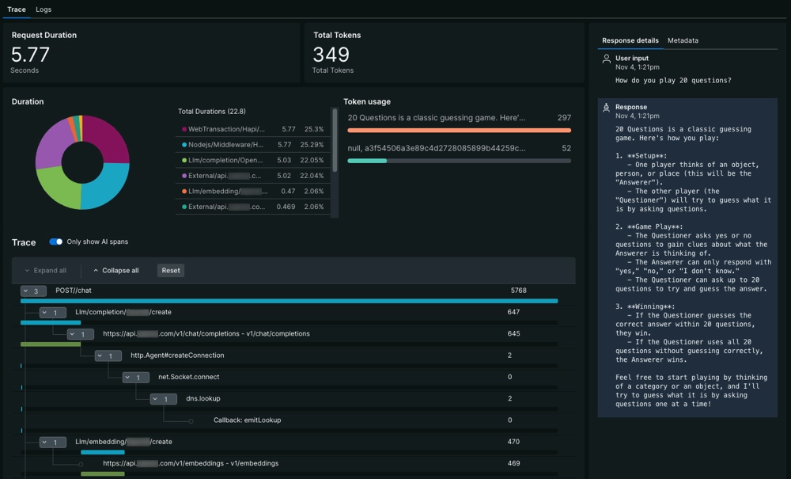

# AI monitoring

AI monitoring is our solution for application monitoring (APM) for AI. When you enable AI monitoring, our APM agents can give you end-to-end visibility into performance, cost, and quality of [supported models](https://docs.newrelic.com/docs/ai-monitoring/compatibility-requirements-ai-monitoring/) from vendors like OpenAI and BedRock. Explore how users interact with an AI assistant, dig into trace-level details about a model's response to an AI event, and compare the performance of different models across app environments

<figure><figcaption>
Go to one.newrelic.com > AI monitoring > AI responses.
</figcaption></figure>

### How does AI monitoring work?  

To get started with AI monitoring, you'll instrument your AI-powered app with one of our APM agents. Once you've instrumented your app, you can enable AI monitoring so the agent can capture LLM observability data.

When your AI assistant receives a prompt and returns a response, the agent captures metric and event data generated from external LLMs and vector stores. Our agent can:

* Parse information about completion, prompt, and response tokens
* Track requests and responses that pass through any of our supported models
* Correlate negative or positive feedback about a response from your end users

You can access all this information and more from the New Relic platform, then create alerts and dashboards to help you effectively manage your AI data and improve performance.

### Improve AI performance with AI monitoring 

<figure><figcaption>
To overview your AI-powered app's performance: Go to <a href="https://one.newrelic.com/"><strong>one.newrelic.com</strong></a> <strong>> AI monitoring > AI responses</strong>.
</figcaption></figure>

AI monitoring can help you answer critical questions about AI app performance: are your end users waiting too long for a response? Is there a recent spike in token usage? Are there patterns of negative user feedback around certain topics? With AI monitoring, you can see data specific to the AI-layer:

* [Identify errors in specific prompt and response interactions](https://docs.newrelic.com/docs/ai-monitoring/explore-ai-data/view-ai-responses/) from the response table. If you're looking to make improvements to your AI models, [learn how to analyze your model with trace-level data](https://docs.newrelic.com/docs/ai-monitoring/explore-ai-data/view-ai-responses/#ai-response-trace-view).
* If you're using different models across app environments, you can [compare the cost and performance of your apps before deploying](https://docs.newrelic.com/docs/ai-monitoring/view-ai-data/#model-comparison).
* Are you concerned about data compliance? [Learn how to create drop filters](https://docs.newrelic.com/docs/ai-monitoring/drop-sensitive-data/) to drop sensitive data before you send it to New Relic.

### Get started with AI monitoring  

Ready to get started? Make sure to [confirm that you can instrument your AI library or framework](https://docs.newrelic.com/docs/ai-monitoring/compatibility-requirements-ai-monitoring/). You may need to update the agent if you've already instrumented your app.

When you're ready, use our doc to [manually install AI monitoring](https://docs.newrelic.com/install/ai-monitoring/). This doc directs you to the relevant procedures for installing an APM agent, then walks you through configuring the agent for AI monitoring.
